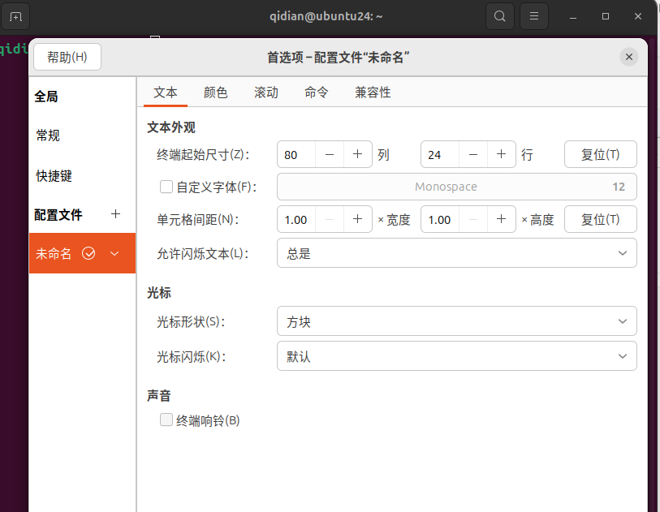
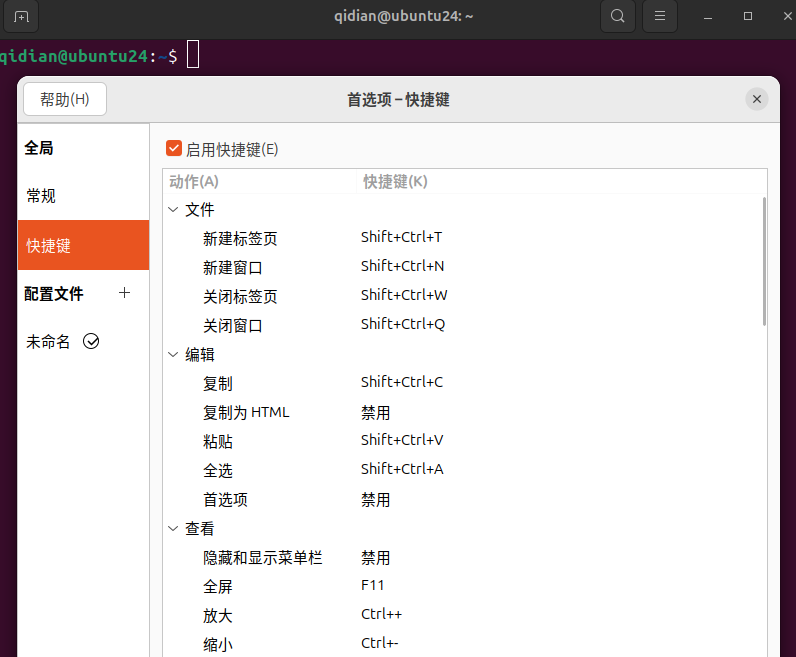
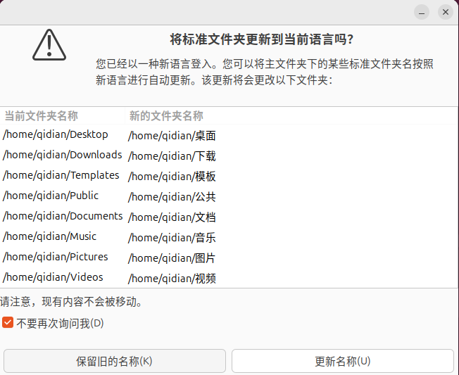
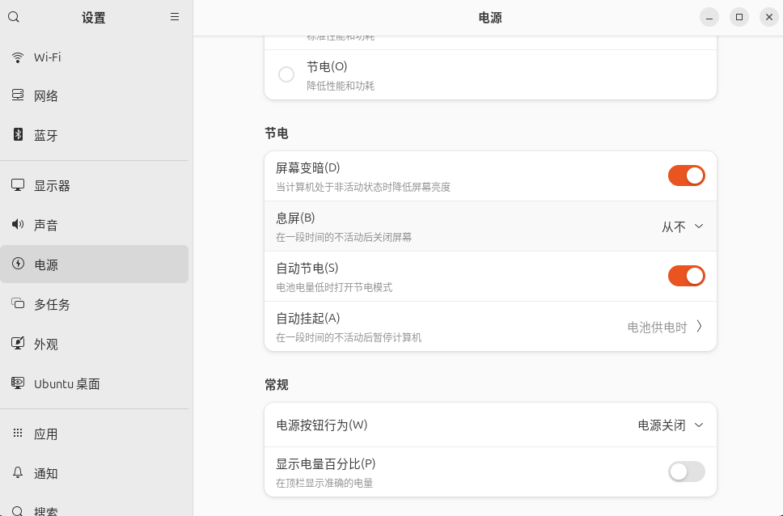
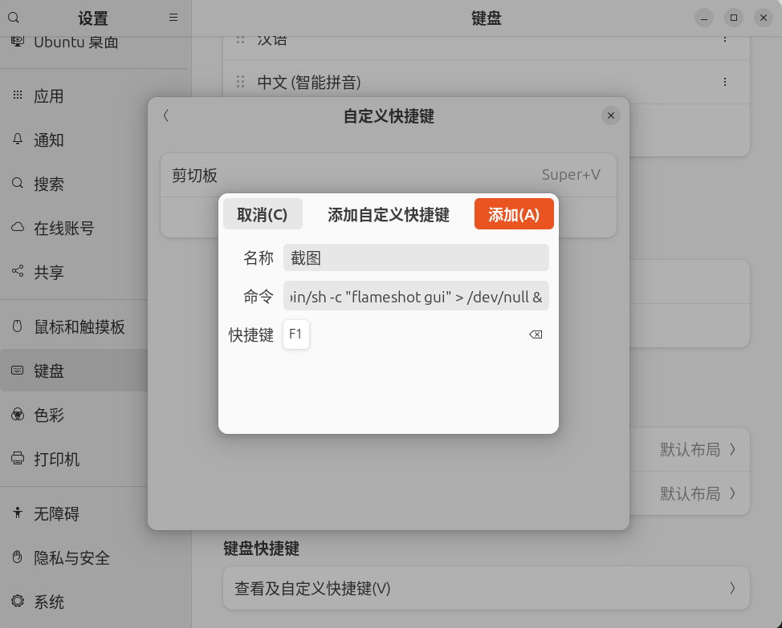
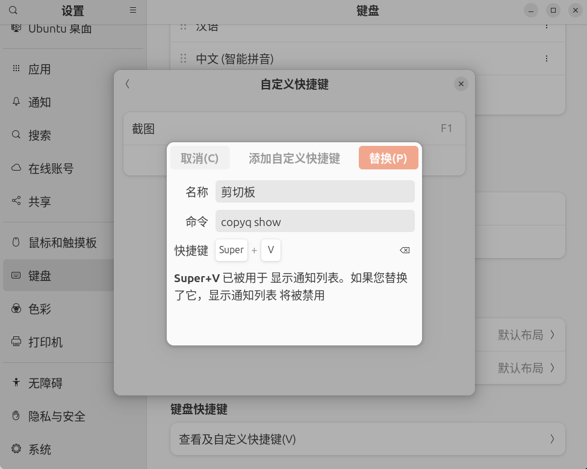

# Ubuntu 新机配置

刚装完系统后该干吗

环境：Ubuntu 24.04

## 换源

```bash
qidian@ubuntu24:~$ cat /etc/apt/sources.list.d/ubuntu.sources
Types: deb
# 原代码改动了下面这行。注释了该行，使其失效
# URIs: http://cn.archive.ubuntu.com/ubuntu/	
# 新增了下面这行
URIs: https://mirror.sysu.edu.cn/ubuntu/		
Suites: noble noble-updates noble-backports
Components: main restricted universe multiverse
Signed-By: /usr/share/keyrings/ubuntu-archive-keyring.gpg

Types: deb
URIs: http://security.ubuntu.com/ubuntu/
Suites: noble-security
Components: main restricted universe multiverse
Signed-By: /usr/share/keyrings/ubuntu-archive-keyring.gpg

```

然后更新源

```bash
sudo apt update 
```

## 换 Fcitx5 输入法

```bash
sudo apt install fcitx5 fcitx5-config-qt fcitx5-material-color fcitx5-chinese-addons fcitx5-table-extra

# 打开设置界面启动 fcitx
fcitx5-configtool

# 切换系统默认输入法框架
im-config
```

`ctrl + space`激活输入法

[微信输入法皮肤](https://github.com/witt-bit/fcitx5-theme-wechat)

[Using Fcitx 5 on Wayland](https://fcitx-im.org/wiki/Using_Fcitx_5_on_Wayland)

## 删掉 Snap

```bash
snap list
# 把list出来的包全删了，先删除软件
sudo snap remove <package>
# 删除 snapd
sudo apt purge snapd -y
# 清理残留
rm -rf ~/snap
```

## 禁用自动更新

```bash
sudo systemctl disable apt-daily.timer
sudo systemctl disable apt-daily-upgrade.timer

sudo systemctl stop apt-daily.timer
sudo systemctl stop apt-daily-upgrade.timer

```

## 禁用自动安全更新/禁用 unattended-upgrades

```bash
sudo apt purge unattended-upgrades -y
```

## 禁用 APT 自动更新

编辑：

```bash
sudo nano /etc/apt/apt.conf.d/20auto-upgrades
```

改成：

```bash
APT::Periodic::Update-Package-Lists "0";
APT::Periodic::Unattended-Upgrade "0";
```

如果文件不存在可以直接创建

## 修改 Grub

编辑：

```bash
sudo nano /etc/default/grub
```

改成：

```bash
# 加入
GRUB_SAVEDEFAULT=true
# 修改
GRUB_DEFAULT=saved 
# 修改
GRUB_TIMEOUT=1
# 删除 quiet splash
GRUB_CMDLINE_LINUX_DEFAULT=""

```

更新 grub：

```bash
sudo update-grub
```

## windows 双系统时间同步

```bash
timedatectl set-local-rtc 1
```

## 关闭终端响铃

谁懂每次按`tab`补全都在叫，吵



## 终端全选

绑定全选快捷键



## 将“下载”等文件夹名称改成英文

```bash
LANG=C xdg-user-dirs-update --force
```

注销或重启生效

勾选“不要再次询问我”，点击“保留旧的名称”



## 关闭自动息屏

节电->息屏->从不



## 字体缩放

```bash
# 下载“优化”
sudo apt install gnome-tweaks
# 打开“优化”
gnome-tweaks
```

调节缩放比例为 1.3


## 开机自动挂载硬盘

```bash
# 找到想要的 NAME
lsblk -f
# 创建要放的位置
sudo mkdir /mnt/c
# 找到 NAME 对应的 UUID
sudo blkid
# 写入以下内容进 /etc/fstab
# 要替换 UUID
UUID=821C044F1C044121 /mnt/c ntfs3 defaults,uid=1000,gid=1000 0 0
# 挂载硬盘看有无报错
sudo mount -a
```

## 剪切板 Pano - Clipboard Manager

```bash
# 依赖
sudo apt install gir1.2-gda-5.0 gir1.2-gsound-1.0
```

## APT 安装常用包

```bash
sudo apt install git curl g++ cmake clangd
sudo apt install openssh-server
sudo apt-get install gnome-browser-connector 

```

## 常用软件

### VScode ——IDE

```bash
wget -O vscode.deb "https://code.visualstudio.com/sha/download?build=stable&os=linux-deb-x64"

sudo apt install ./vscode.deb
```


### Typora——markdown编辑器

```bash
wget https://downloads.typoraio.cn/linux/typora_1.13.6_amd64.deb
sudo dpkg -i typora_1.13.6_amd64.deb
```

### 微信

```bash
wget https://dldir1v6.qq.com/weixin/Universal/Linux/WeChatLinux_x86_64.deb
sudo dpkg -i WeChatLinux_x86_64.deb
```

### QQ

https://im.qq.com/index/#/linux

### chrome——浏览器

https://www.google.com/intl/zh-CN/chrome/

### FlClash

```bash
wget https://github.com/chen08209/FlClash/releases/download/v0.8.93/FlClash-0.8.93-linux-amd64.deb
sudo apt-get install libayatana-appindicator3-dev
sudo apt-get install libkeybinder-3.0-dev
sudo dpkg -i FlClash-0.8.93-linux-amd64.deb
```

### fastfetch——查看系统信息

```bash
sudo add-apt-repository ppa:zhangsongcui3371/fastfetch
sudo apt update
sudo apt install fastfetch
```

### GSConnect——手机剪切板同步

https://extensions.gnome.org/extension/1319/gsconnect/

### Claud Code

```bash
# 下载并安装 nvm：
curl -o- https://raw.githubusercontent.com/nvm-sh/nvm/v0.40.3/install.sh | bash

# 代替重启 shell
\. "$HOME/.nvm/nvm.sh"

# 下载并安装 Node.js：
nvm install 24

# 验证 Node.js 版本：
node -v # Should print "v24.16.0".

# 验证 npm 版本：
npm -v # Should print "11.13.0".

# 安装 cc
npm install -g @anthropic-ai/claude-code
```

### CC Switch

```bash
wget https://github.com/farion1231/cc-switch/releases/download/v3.16.1/CC-Switch-v3.16.1-Linux-x86_64.deb

sudo apt install ./CC-Switch-v3.16.1-Linux-x86_64.deb 
```

### flameshot——类 snipaster 截图

```bash
sudo apt install flameshot
```

设置截图快捷键为 F1，命令

```bash
/bin/sh -c "flameshot gui" > /dev/null &
```




### copyq——剪切板

```bash
sudo apt install copyq
```

设置使用 XWayland ，不然读不到复制的内容

```bash
# 编辑
sudo nano /usr/share/applications/com.github.hluk.copyq.desktop
```

增加`env QT_QPA_PLATFORM=xcb`

```bash
# 改前
Exec=copyq --start-server show
# 改后
Exec=env QT_QPA_PLATFORM=xcb copyq --start-server show
```

设置快捷键



设置开机自启动

```bash
cp /usr/share/applications/com.github.hluk.copyq.desktop ~/.config/autostart/
```

### 坚果云——文件同步

https://www.jianguoyun.com/s/downloads/linux

### KeepassXC——密码管理工具 

```bash
sudo apt install keepassxc
```

### 飞书

https://www.feishu.cn/download

### WPS

https://www.wps.cn/product/wpslinux#

### Foxglove——ROS 调试软件

```bash
wget https://get.foxglove.dev/desktop/latest/foxglove-studio-latest-linux-amd64.deb
sudo apt install ./foxglove-studio-latest-linux-amd64.deb
```

### plotjuggler

```bash
wget https://github.com/PlotJuggler/PlotJuggler/releases/download/3.17.2/PlotJuggler-3.17.2-x86_64.AppImage

chmod +x PlotJuggler-3.17.2-x86_64.AppImage
./PlotJuggler-3.17.2-x86_64.AppImage
```

### GUI 硬盘分区工具

```bash
sudo apt install gparted
```
